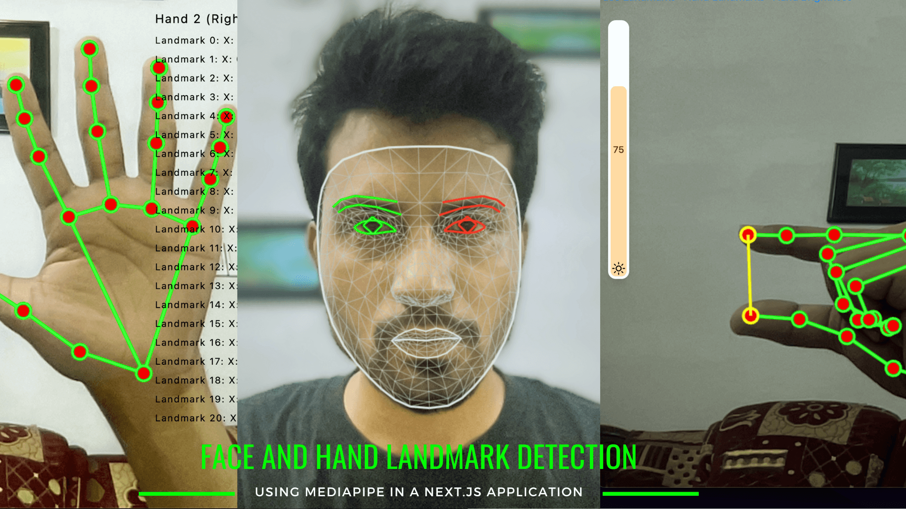

<a href="https://face-hand-tracker.vercel.app/">
  
  <h1 align="center">Face - Hand Tracker</h1>
</a>

<p align="center">
  An open-source real-time face and hand landmark detection using Mediapipe in a Next.js application
</p>

**On-device machine learning for everyone**

Delight your customers with innovative machine learning features. MediaPipe
contains everything that you need to customize and deploy to mobile (Android,
iOS), web, desktop, edge devices, and IoT, effortlessly.

## Set up and run

1. Clone the repository

```bash
https://github.com/shahriarshafin/face-hand-tracker.git
```

2. Change the working directory

```bash
cd face-hand-tracker
```

3. Install dependencies

```bash
npm install # or, yarn install
```

4. Run the app in development mode

```bash
npm run dev # or, yarn dev
```

That's All! Now open [localhost:3000](http://localhost:3000/) to see the app.

- [See more demos](https://goo.gle/mediapipe-studio)

## Get started

You can get started with MediaPipe Solutions by by checking out any of the
developer guides for
[vision](https://developers.google.com/mediapipe/solutions/vision/object_detector),
[text](https://developers.google.com/mediapipe/solutions/text/text_classifier),
and
[audio](https://developers.google.com/mediapipe/solutions/audio/audio_classifier)
tasks. If you need help setting up a development environment for use with
MediaPipe Tasks, check out the setup guides for
[Android](https://developers.google.com/mediapipe/solutions/setup_android), [iOS](https://ai.google.dev/edge/mediapipe/solutions/setup_ios), [Web
apps](https://developers.google.com/mediapipe/solutions/setup_web), and
[Python](https://developers.google.com/mediapipe/solutions/setup_python).

## Solutions

MediaPipe Solutions provides a suite of libraries and tools for you to quickly
apply artificial intelligence (AI) and machine learning (ML) techniques in your
applications. You can plug these solutions into your applications immediately,
customize them to your needs, and use them across multiple development
platforms. MediaPipe Solutions is part of the MediaPipe, so you can further customize the
solutions code to meet your application needs.

These libraries and resources provide the core functionality for each MediaPipe
Solution:

- **MediaPipe Tasks**: Cross-platform APIs and libraries for deploying
  solutions. [Learn
  more](https://developers.google.com/mediapipe/solutions/tasks).
- **MediaPipe models**: Pre-trained, ready-to-run models for use with each
  solution.

These tools let you customize and evaluate solutions:

- **MediaPipe Model Maker**: Customize models for solutions with your data.
  [Learn more](https://developers.google.com/mediapipe/solutions/model_maker).
- **MediaPipe Studio**: Visualize, evaluate, and benchmark solutions in your
  browser. [Learn
  more](https://developers.google.com/mediapipe/solutions/studio).

## License

This project is licensed under the MIT License - see the [`LICENSE`](LICENSE) file for details.
